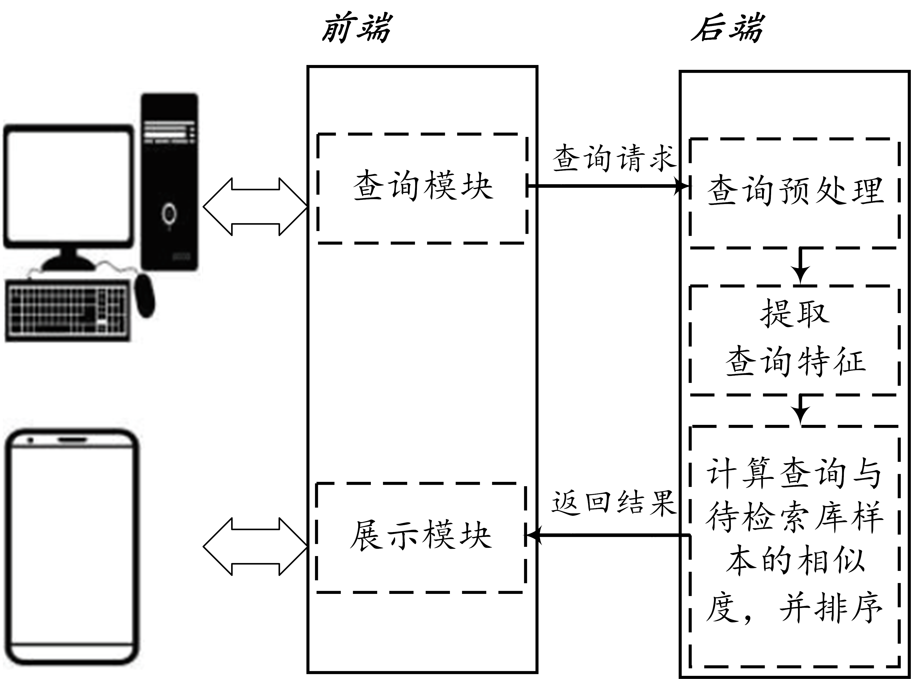
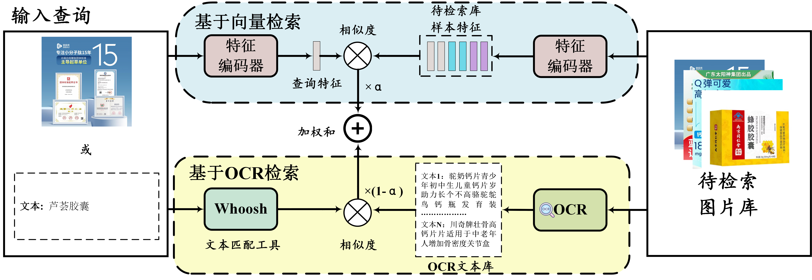

# 基于跨模态检索的网络交易风险信息检索工具

基于跨模态检索的网络交易风险信息检索工具的**python后端代码**。

针对网络违法交易行为的跨模态检索需求，设计并实现了一种结合语义向量检索与OCR识别的方法，能够高效处理包含大量文字描述的图像数据，实现跨模态的图文检索，并利用大语言模型（LLM）生成高质量文本的能力，生成图片描述，从而提升检索模型精度。

<br />**交互逻辑：**

<p align="center">
  <a href="https://github.com/huangxixiyiqi/demo">
    
  </a>


**跨模态检索模型图：**


<p align="center">
  <a href="https://github.com/huangxixiyiqi/demo">
    
  </a>


</p>

## 目录

- [基于跨模态检索的网络交易风险信息检索工具](#基于跨模态检索的网络交易风险信息检索工具)
  - [目录](#目录)
    - [上手指南](#上手指南)
          - [环境](#环境)
          - [**安装步骤**](#安装步骤)
    - [文件目录说明](#文件目录说明)
    - [运行](#运行)
    - [使用到的框架](#使用到的框架)
    - [作者](#作者)

  

### 上手指南

###### 环境

* **python 3.8**
* **pytorch 1.9.0**
* **torchvision 0.10.0**
* **tensorboard 2.6.0**
* **tqdm 4.62.0**
* **easydict 1.9**
* **h5py 2.10.0**
* **cuda 11.1**

###### **安装步骤**

我们使用 Anaconda 设置了一个支持 PyTorch 的深度学习工作区。运行以下脚本来安装所需的软件包。

```shell
conda create --name demo python=3.8

conda activate demo

git clone https://github.com/huangxixiyiqi/demo-py.git

cd demo

pip install -r requirements.txt

conda deactivate
```


### 文件目录说明
```
demo 
├── requirements.txt
├── README.md
├── /ali_data_prepare/    # 数据预处理
├── /indexdir/            # whoosh索引
├── /templates/    				# html页面
├── /config/              # 配置文件
├── /run_sh/              # 运行脚本  
├── /static/              # 静态资源， css样式文件
│  ├── /imgs/
├── .gitignore
├── client.py
├── environment.yml
├── extract_all_pic_CLIP_feat.py
└── extract_all_pic_cnCLIP_feat.py
└── grouping.py
├── i2i.py
└── i2t.py
├── init_model.py
├── main.py
├── merge.py
├── ret.py
├── ret_whoosh.py
├── server.py
```


### 运行

```shell
conda activate demo
sh ./run_sh/start.sh
```


### 使用到的框架

- [CLIP](https://github.com/openai/CLIP)
- [Chinese-CLIP](https://github.com/OFA-Sys/Chinese-CLIP)
- [Faiss](https://github.com/facebookresearch/faiss)
- [Whoosh](https://whoosh.readthedocs.io/en/latest/quickstart.html)

### 作者

huangxixi


